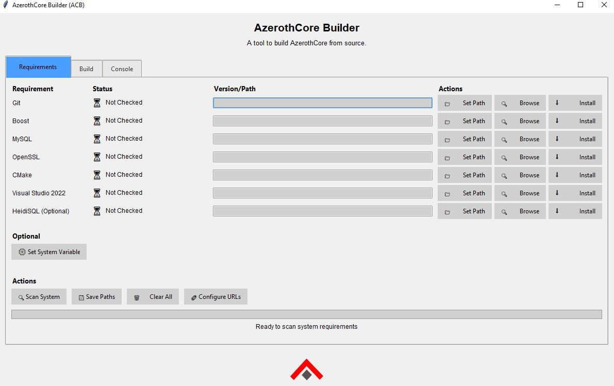
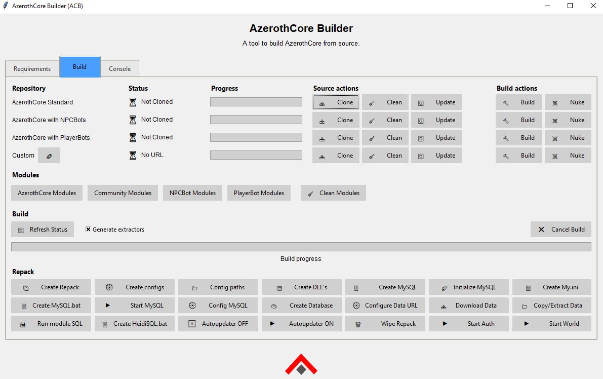
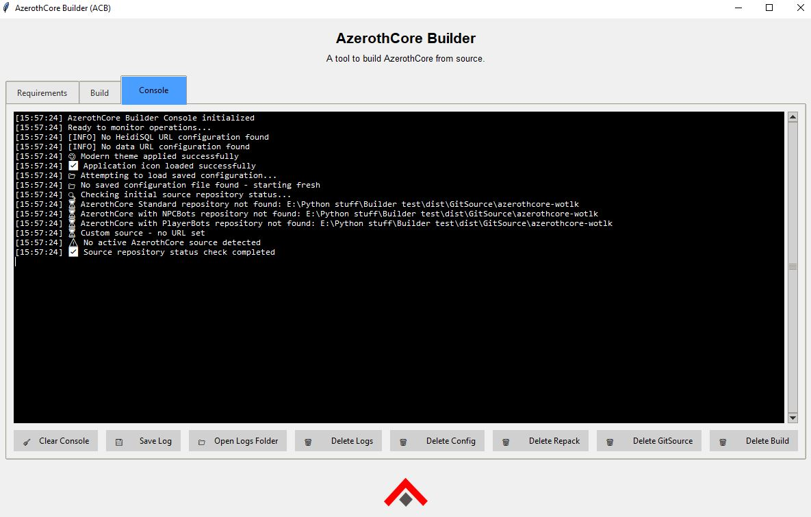

# AzerothCore Builder (ACB)

A comprehensive GUI application for building and managing AzerothCore servers on Windows. ACB provides an intuitive interface for downloading, compiling, and configuring AzerothCore with all necessary dependencies.

## 🚀 Features

- **Automated Dependency Management**: Automatically detects and installs required tools (Git, CMake, Visual Studio, MySQL, etc.)
- **One-Click AzerothCore Setup**: Download and compile AzerothCore with a single click
- **Database Management**: Automated database creation and configuration
- **Visual Studio Integration**: Automatic detection and configuration of Visual Studio components
- **Progress Tracking**: Real-time progress bars and detailed logging
- **Path Management**: Smart detection of installation paths and manual override options
- **Modern GUI**: Clean, responsive interface with consistent styling

## 📋 Requirements

- Windows 10/11 (64-bit)
- Python 3.8 or higher
- Administrator privileges (for installing dependencies)

## 🛠️ Installation

### Option 1: Direct Download
1. Clone or download this repository
2. Install Python dependencies:
   ```bash
   pip install -r requirements.txt
   ```
3. Run the application:
   ```bash
   python ACB.py
   ```

### Option 2: Executable (Coming Soon)
- Download the latest release executable (when available)
- Run `ACB.exe` directly

## 📸 Screenshots

<div align="center">
  
  <p><em>ACB Main Interface - Dependency Detection and Management</em></p>
</div>

<div align="center">
  
  <p><em>ACB Progress Tracking - Real-time Build Progress</em></p>
</div>

<div align="center">
  
  <p><em>ACB Configuration - Path Management and Settings</em></p>
</div>

## 🎯 Usage

1. **Launch ACB**: Run the application with administrator privileges
2. **Check Dependencies**: The app will automatically scan for required tools
3. **Install Missing Components**: Click "Install" for any missing dependencies
4. **Configure Paths**: Set your preferred installation directories
5. **Build AzerothCore**: Click "Build AzerothCore" to start the compilation process

## 📁 Project Structure

```
ACB/
├── ACB.py              # Main application file
├── icons/              # Application icons
│   ├── ACB.ico         # Main application icon
│   └── AZC.png         # AzerothCore logo
├── screenshots/        # Application screenshots
│   ├── ACB1.JPG       # Main interface screenshot
│   ├── ACB2.JPG       # Progress tracking screenshot
│   └── ACB3.JPG       # Configuration screenshot
├── requirements.txt    # Python dependencies
├── LICENSE            # MIT License
└── README.md          # This file
```

## 🔧 Dependencies

ACB automatically manages the following dependencies:

- **Git** - Version control
- **CMake** - Build system
- **Visual Studio** - C++ compiler and tools
- **MySQL** - Database server
- **Boost** - C++ libraries
- **OpenSSL** - Cryptographic library

## 🎨 UI Features

- **Consistent Styling**: Green progress bars and unified icon design [[memory:8464194]]
- **Comprehensive Logging**: All actions and operations are logged to console [[memory:8291938]]
- **Manual Path Selection**: Override automatic path detection when needed
- **Real-time Progress**: Visual feedback for all operations

## 🚨 Troubleshooting

### Common Issues

1. **Permission Errors**: Run as administrator
2. **Missing Dependencies**: Use the built-in installer
3. **Path Issues**: Manually select installation paths
4. **Visual Studio Issues**: Ensure "Desktop development for C++" workload is installed [[memory:7118280]]

### Getting Help

- Check the console output for detailed error messages
- Ensure all dependencies are properly installed
- Verify Windows version compatibility

## 🤝 Contributing

We welcome contributions! Please see [CONTRIBUTING.md](CONTRIBUTING.md) for guidelines.

## 📄 License

This project is licensed under the MIT License - see the [LICENSE](LICENSE) file for details.

## 🙏 Acknowledgments

- AzerothCore team for the amazing server core
- Python community for excellent libraries
- All contributors and testers

## 📞 Support

For issues and questions:
- Create an issue on GitHub
- Check the troubleshooting section above
- Review console logs for detailed error information

---

**Note**: This application is designed specifically for Windows environments and requires administrator privileges for full functionality.